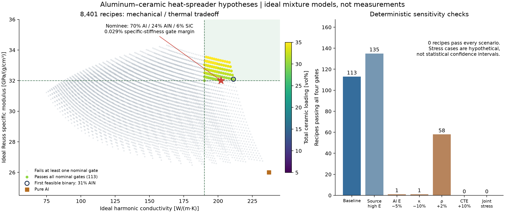

# A candidate recipe, with weak evidence for an advantage

The study nominates **70% Al / 6% SiC / 24% AlN by volume** as the least-ceramic-loading recipe passing the nominal screen. Its ideal model gives a Young-modulus Reuss endpoint of **91.8 GPa**, density **2.868 g/cm³** and harmonic conductivity **202 W/(m·K)**. These are conditional calculations from sourced constituent proxies, not measured properties. The composite family has prior art; this work has **not established a novel material**.

The useful result is a reproducible hypothesis and a clear reason to be cautious: the nominee clears the specific-stiffness gate by only **0.029%**. No recipe in the search passes every sensitivity scenario. Fabrication and measurements are necessary before preferring it to a simpler Al/AlN composite.

## Search and nominee

The library evaluates 8,401 nominal compositions on a 1 volume-percent grid, with 5–35% total ceramic loading; seven scenarios give 58,807 evaluations. Nominally, 113 recipes pass all four declared gates. Ranking first minimizes total ceramic loading, then maximizes the harmonic conductivity endpoint, then maximizes the specific Reuss modulus. This ranking preference is explicit; the recipe is not a global optimum over all properties, materials or processes.

| Nominee quantity | Calculated value | Interpretation |
| --- | ---: | --- |
| Phase volume fractions | Al 70%, SiC 6%, AlN 24% | No alumina selected |
| Density | 2868 kg/m³ | Ideal zero-porosity retained-phase mixture |
| Young modulus, Reuss–Voigt endpoints | 91.80–149.69 GPa | Ideal isotropic-phase elastic envelope, not prediction uncertainty |
| Specific Reuss modulus | 32.0093 GPa/(g/cm³) | Gate is 32; relative margin 0.029% |
| Conductivity, harmonic–arithmetic endpoints | 202.01–212.86 W/(m·K) | Perfect-contact Fourier model; interface resistance excluded |
| Volume-average CTE proxy | 17.5152 × 10⁻⁶/K | Gate is 18; mismatched constituent temperature intervals |
| Turner CTE proxy | 13.5760 × 10⁻⁶/K | Hydrostatic compatibility proxy; not a measured coefficient |

Compared with the sourced pure-Al baseline, its specific Reuss modulus is about **23.1% higher**, while density is **6.2% higher** and its harmonic conductivity endpoint is **14.8% lower**. A thermal-management claim must account for that conduction tradeoff rather than imply every property improves.

For a hypothetical 100 mm unconstrained specimen over a 25 K temperature change, the library's constant-coefficient model gives approximately 43.8 µm expansion from the volume-average proxy and 33.9 µm from the Turner proxy. The sourced Al coefficient gives 57.75 µm. These examples illustrate the chosen models; they do not validate a temperature-dependent composite expansion law.

The recipe's ideal phase mass fractions and elemental mass/atomic fractions are recorded in [summary.json](results/summary.json), with the actual composition-tool response in [tool-records.json](results/tool-records.json). Phase volume percentages must not be used as powder mass percentages. Formula conversion assumes pure stoichiometric phases and omits commercial-grade additives and reactions.

## Simpler controls

| Recipe, volume % | Density kg/m³ | Reuss E GPa | Specific Reuss E | Harmonic κ W/(m·K) | Nominal outcome |
| --- | ---: | ---: | ---: | ---: | --- |
| Pure Al | 2700 | 70.20 | 26.000 | 237.00 | Fails stiffness and CTE gates |
| 70 Al / 30 SiC | 2820 | 92.35 | 32.747 | 170.14 | Fails conductivity gate |
| 70 Al / 30 AlN | 2880 | 91.67 | 31.829 | 211.94 | Fails specific-stiffness gate |
| 70 Al / 30 alumina | 3075 | 92.74 | 30.161 | 83.03 | Fails all four gates |
| **70 Al / 6 SiC / 24 AlN** | **2868** | **91.80** | **32.009** | **202.01** | **Passes nominal screen** |
| 69 Al / 31 AlN | 2886 | 92.61 | 32.090 | 211.20 | First feasible binary recipe |

Specific modulus units are GPa/(g/cm³). The first three ceramic controls use the same 30% total reinforcement loading as the nominee. Adding one percentage point of AlN makes the binary feasible: compared with it, the hybrid saves only 18 kg/m³ and one percentage point of reinforcement while losing approximately 9.18 W/(m·K) of modeled harmonic conductivity. Neither recipe dominates all objectives, and the hybrid's extra processing complexity is not priced in the model.

## Sensitivity changes the conclusion

| Scenario | Recipes passing all gates |
| --- | ---: |
| Baseline sourced proxies | 113 |
| Source-high SiC and AlN moduli | 135 |
| Al modulus reduced by 5% | 1 |
| Constituent conductivities reduced by 10% | 1 |
| Constituent densities increased by 2% | 58 |
| Constituent CTE proxies increased by 10% | 0 |
| Joint stress case | 0 |

These are deterministic source comparisons and hypothetical stresses, not probabilities or confidence intervals. No recipe passes every scenario. The CTE-stress failure has a simple independent check: the lowest possible volume-average CTE in the allowed design space is 16.422 × 10⁻⁶/K at 65% Al / 35% SiC. Increasing it by 10% gives 18.0642 × 10⁻⁶/K, above the gate regardless of stiffness or conductivity. This establishes infeasibility only within this dataset, loading cap and proxy rule; it does not exclude all real composites.

The largest minimum nominal gate margin belongs to **66% Al / 7% SiC / 27% AlN** by volume. It gives density 2890 kg/m³, Reuss E 95.74 GPa, harmonic conductivity 197.81 W/(m·K) and volume-average CTE proxy 16.7694 × 10⁻⁶/K. Its weakest nominal gate margin is 3.52%, compared with the minimum-loading nominee's 0.029%. It still fails stress scenarios, so the larger nominal margin does not establish robustness. Both options and all scenario-specific gate outcomes are retained in the machine-readable summary.

## What would establish a discovery

First, compare the proposed hybrid and matched-loading binary controls using the same processing route. Verify actual phase fractions, porosity, dispersion, interface chemistry and reaction products before interpreting the ideal-mixture models. Measure elastic modulus, thermal conductivity and CTE over a common temperature interval, including repeat thermal cycles. Keep strength, toughness and fatigue separate from stiffness.

The [prior-art review](PRIOR_ART.md) confirms the family is established and describes the limited scope of the search. An exact recipe could still be worth exploring, but novelty requires a broader literature/patent review and a distinctive, validated performance or processing result. The present recommendation is **candidate testing**, with the simple Al/AlN control treated as a serious alternative.

The [method and sources](README.md), [frozen inputs](inputs.json), [nominal candidate table](results/candidates.csv), [all-scenario compressed table](results/candidates.csv.gz), [summary](results/summary.json), [tool responses](results/tool-records.json) and [exportable SVG](results/tradeoffs.svg) provide the reproducible record.
