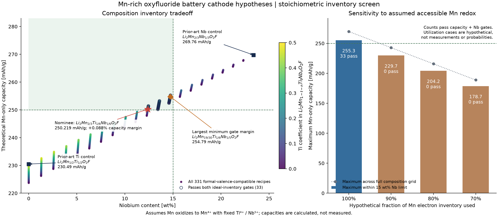

# Discovery attempt: lower-niobium manganese oxyfluoride cathodes

## Result

The toolkit screened **331 nominal lithium-rich manganese oxyfluoride compositions** for a battery-cathode application. **33 meet the declared ideal-capacity and Nb-loading gates**. Ranking them by least niobium mass fraction nominates:

**Li2Mn2/3Ti1/6Nb1/6O2F**, a computational composition hypothesis.

Its calculated Mn-only redox reservoir is **250.219 mAh/g**, with **12.391% Nb by mass**. It narrowly clears the 250 mAh/g threshold and would require **99.9124% of its assumed Mn redox** to reach that target. There is no established exact-recipe novelty, synthesized specimen or improved measured battery performance. The manganese oxyfluoride family, both endpoint controls and mixed Ti/Nb compositions are prior art.

Export the [SVG figure](results/tradeoffs.svg) or inspect the [full CSV](results/candidates.csv), [summary](results/summary.json) and [662 actual tool responses](results/tool-records.json). The plot depicts a stoichiometric screening model, not measured electrochemical data.

## Why this material class

These are hypotheses for lithium-ion positive-electrode active materials, a different chemistry and purpose from the earlier aluminum heat-spreader composites. The intended family is related to lithium-rich disordered-rocksalt oxyfluorides. Formal manganese oxidation supplies charge during lithium extraction; Ti and Nb are treated as high-valent spectators in this model. Fluorine changes the formal anion charge budget. No structural or cycling benefit is calculated from those choices.

The design question is whether a mixed Ti/Nb composition can retain a large formal Mn reservoir while reducing Nb loading relative to a published Nb-rich control. Niobium loading is an explicit material-use objective, not a prediction of cost, supply-chain performance or environmental benefit. Nominal elemental composition cannot demonstrate a disordered-rocksalt phase or specify an atomic arrangement.

## Search and controls

The searched formula is `Li2Mn_(1-t-n)Ti_tNb_nO2F`, with Ti and Nb coefficients on a 1/60 grid. Charge bookkeeping fixes Li(+1), Ti(+4), Nb(+5), O(-2), F(-1), and requires initial average Mn between +2 and +3. It gives `v_Mn = (3 - 4t - 5n)/(1 - t - n)`, so admissible grid points satisfy `2i_Ti + 3j_Nb <= 60`. All 331 are included.

Each recipe receives two actual toolkit calls: `composition.analyze` on a reduced integer formula, and `composition.from_fractions` on its unreduced atom weights. Formula masses and mass fractions are cross-checked. Formal Mn-only capacity is then calculated in the experiment as `F(1+n)/(3.6M)`, assuming Mn ends at +4 and Ti/Nb remain spectators. The toolkit does not have an electrochemical property predictor, and these calculations do not create one.

The gates are ideal Mn-only capacity >=250 mAh/g and Nb <=15 wt%. Passing recipes rank by lower Nb **mass fraction**, then higher ideal capacity. This intentionally differs from ranking by Nb site coefficient. All capacities below use the same formal reservoir and pristine nominal active-material mass basis; none are new measured results.

| Composition | Initial average Mn valence | Ideal Mn-only capacity (mAh/g) | Nb (wt%) | Gate outcome |
| --- | ---: | ---: | ---: | --- |
| Li2MnO2F comparator | 3.000 | 223.692 | 0 | Capacity fails |
| Published Li2Mn1/2Ti1/2O2F control | 2.000 | 230.493 | 0 | Capacity fails |
| Published Li2Mn2/3Nb1/3O2F control | 2.000 | 269.760 | 23.378 | Nb loading fails |
| **Nominated Li2Mn2/3Ti1/6Nb1/6O2F** | **2.250** | **250.219** | **12.391** | **Nominal pass** |
| Largest minimum gate margin: Li2Mn19/30Ti1/6Nb1/5O2F | 2.105 | 254.788 | 14.720 | Nominal pass |
| Largest capacity under Nb limit: Li2Mn3/5Ti1/5Nb1/5O2F | 2.000 | 255.265 | 14.748 | Nominal pass |

The 2018 Nature author manuscript reports theoretical capacities of approximately 270 and 230 mAh/g for the Nb and Ti controls, consistent with the independent calculations here. Published experimental controls do not validate a new interpolation. Source evidence and exact citations are in [PRIOR_ART.md](PRIOR_ART.md).

## What the nomination buys—and how fragile it is

For the nominated formula, the normalized molar mass is **124.963993495 g/mol** and the formal reservoir is **7/6 electrons per formula**. Initial average Mn +2.25 is a charge-balance result under the spectator assumptions, not a measured local oxidation state. If only Li extraction compensates the modeled oxidation, **5/6 Li per formula** remains after accessing this reservoir; that is bookkeeping, not an observed charged phase.

Relative to the Nb control, the nominee reduces Nb loading from 23.378 to 12.391 wt%, approximately **47% less**, while its formal capacity is approximately **7.2% lower**. Its Nb coefficient also falls from 1/3 to 1/6. These are composition and mass trades; better real performance does not follow.

Its capacity margin is only **0.0877%**. A recipe that maximizes the weakest normalized gate margin instead is `Li2Mn19/30Ti1/6Nb1/5O2F`, with a minimum margin of **1.8652%**. The highest ideal capacity allowed by the Nb gate is 255.265 mAh/g at `Li2Mn0.6Ti0.2Nb0.2O2F`; it is a different optimization result, not the maximum-margin recipe. All remain unvalidated.

| Hypothetical fraction of formal Mn redox accessed | Passing recipes |
| --- | ---: |
| 100% | 33 |
| 90% | 0 |
| 80% | 0 |
| 70% | 0 |

These outcomes are deterministic model sensitivity, not predicted experimental utilization or evidence of physical material failure. Even the global grid maximum, the published Nb control, supplies only **242.784 mAh/g** at 90% of its Mn reservoir. Under the 15 wt% Nb limit, the maximum supplies **229.738 mAh/g** at 90%. Thus no recipe in this grid can reach the target in those scenarios without another charge source or a different composition/model. Oxygen redox can supply additional charge; the Mn-only inventory is not a total-capacity ceiling.

## Limits and useful next work

Formal charge balance does not establish a stable single phase, local valence, atomic configuration, disorder, lattice density, ion transport or a viable manufacturing route. Fixed Ti(+4) is particularly important: a related Ti-series abstract reports Ti(+3), so the spectator assumption is not verified across the grid. Oxygen redox, defects and changes in composition can alter the actual charge inventory. No voltage curve, energy density, reversible utilization, cycle life, electrode or full-cell performance is predicted.

A scoped review found the exact endpoint controls, a Ti substitution series and a directly characterized mixed Mn/Ti/Nb oxyfluoride at different Li/O/F ratios. It did not establish novelty of the nominee; exact-composition full-text and patent coverage remain incomplete. Increasing the number of components alone cannot justify a high-entropy or transport advantage.

The next evidence should concern **phase formation and accessible charge**, rather than further optimizing this electron-count model. Use competing-phase and disorder calculations, local-valence/fluorine measurements and lithium-migration analysis. If phase evidence is satisfactory, compare the nominee, the two alternative mixed recipes and the published controls under matched synthesis and electrode conditions, measuring reversible capacity versus voltage and current, cycle retention and oxygen activity.

This experiment contains **662 actual toolkit calls** and **1,324 candidate/scenario evaluations**. Complete responses, input hashes and sources are retained, while numerical replay is offline. See [README.md](README.md) for equations, assumptions and commands; independent tests check physical bookkeeping and provenance. No new production tool, dependency or fabricated structure is introduced.
